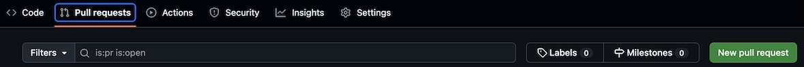

# Worlorn

Worlorn is a fantasy role playing campaign, active from 1979–90, 1992–3, 1995–99, and recently starting again June of 2002. Gaming tends to be face-to-face, but remote players contribute from a dozen states and overseas.

Worlorn derives Inspiration from multiple RPG systems, including the primordial half-sized D&D booklets by Gygax and Arneson. Yet focus is always directed toward solid characterization and fine storytelling rather than dice and combat. While we do not LARP, occasionally we enjoy more activity than merely tossing dice. There have been drinking dungeons, but the game master has trouble remembering details.

There is no online play here. This site contains accounts of various oddities without framework. Material here is displayed not as a substitute for gaming. but for clarification, curiosity, and remembrance.

Worlorn storylines incorporate recognizable legends from historical reality and works of fiction. However, where inferior campaigns apply the whole cloth of myth into a patchwork quilt displayed—but not changeable—by players, Worlorn weaves the thread of outworld myth seamlessly into Worlorn culture and events for players to explore, change or ignore, as they desire. The Patterns of Worlorn activity are dominated by player characters.

&nbsp;&nbsp;That's the point.

*Above all, we play to have fun*

# Contribute

You can help keep things up to date! 

This site is hosted on [github](https://github.com/DataDink/worlorn). To make changes or add a new file you can open a [pull-request](https://docs.github.com/en/pull-requests/collaborating-with-pull-requests/proposing-changes-to-your-work-with-pull-requests/creating-a-pull-request) with your changes to be approved by a moderator. There are no special skills required to contribute. The pages of this site are written in plain-text using [github-flavored MARKDOWN](https://docs.github.com/en/get-started/writing-on-github/getting-started-with-writing-and-formatting-on-github/basic-writing-and-formatting-syntax) to keep things simple and accessible.

The simplest steps for contributing:

* [Fork](https://github.com/DataDink/worlorn/fork) a copy of the site.
* Edit, add, remove files as neccessary.
* Make a pull-request with your changes.

