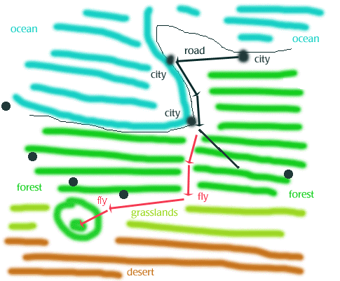

# the legend of anael

a second angel comes to troad
>
>   Lazarus, the father of Anael, was one of Jovah’s three Oracles in Samaria. Lazarus had fallen ill with the cancer. Although he had a place in the heart of Jovah, Lazarus was dying before the next Oracle had come forth for training. Times were very bad when there were only two oracles to serve Jovah’s people in Samaria. Many people were afraid.
>
>   Forever his good daughter, Anael had learned to read Jovah’s signs and foretelling at her father’s knee. When Anael’s father refused to ask Jovah to save himself, Anael rose from her bed one dark night and dared to approach the tools of revelation while everyone else was asleep. For her father, the good daughter Anael would risk anything.
>
>   When she had prepared herself to wield the tools of revelation, Jovah asked Anael to identify herself, which she did. Even though her father was not in the room, Jovah responded the same as if Lazarus was at her side. Anael composed her question quickly, and reviewed the words three times before offering her question to Jovah: “How can I save my father from the cancer?”
>
>   Lo, but Jovah answered this question! Jovah answered the question asked by Anael alone!
>
>   “Aid the children of Larethian to restore their father, and they shall aid you to restore your own. Follow this quest and the cancer will not take your father from you.”
>
>   Anael waited a minute before asking a second question. She was certain the name was unknown to her. “Where may Larethian’s children be found?”
>
>   So it was that Jovah told Anael, “Sail south with the Edori fleet seeking Ysrael.” Although Jovah most often revealed his will in words, for this answer Jovah granted a vision of a map of far Ysrael. Jovah said, “This map will lead Anael to a clearing within an enchanted wood, where Anael will meet children of Larethian.” 
>
>   In humility, Anael made a sketch of the map to aid her imperfect memory. It is displayed here.

    
>
>   Anael waited a minute before asking a third and last question. “How will I know the children of Larethian when I do see them?”
>
>   Jovah then displayed the faces of strangers to Anael in a series of four visions. But although Anael recognized not the persons, she was able to know the strangers for *elves*, for Anael had chosen to study the eldren legends more than a year before, and was current in her studies. 
>
>   Fifteen months before the cancer had put him in his bed, Lazarus had finally asked his good daughter to select a first course of study. Although she was the good daughter, and although she had been waiting without patience for her father to teach her higher learning, she was also a willful soul. So it was that Anael had thrown open a book at random and pointed, for the day was sunny, and she would have preferred to have been soaring on her wings by her mother’s side. 
>
>   One of the mysteries of Jovah was that on the random page where her finger touched, fifteen months before she asked Jovah a third question, there was a poem written by an elf lord. Thereafter was her father’s insistence that she research this elven rhyme, and any more question that arose thereby. It was thus that when she saw the faces of the children of Larethian, Anael knew them as *elves*, even though she had never seen one with her eyes.
>
>   It is said that when Anael finally met the children of Larethian, the visions had faded in her memory. The face of the Larethian sister, Mestea, seemed unlike the face in Jovah’s vision. However, it is also said that later in life Mestea likened not to her twin Marcellus as she had when they issued from Rilea’s womb. Jovah and memory could both be correct, yet still Mestea’s face might be changed.
>
>   Although Anael’s mother knew the actions of her good daughter, Anael never revealed her three questions of Jovah to her father, not even when she said goodbye. The next morning, Anael could not bring herself to tell her father what she had done while he was sleeping. She was the good daughter, and was never eager to face his disappointment. Thus Anael could tell him only, “I must follow my studies and the will of Jovah and sail to Ysrael.” Lazarus wept and held her close, kissed her and blessed her travels in Jovah’s name. “We will see each other again when Jovah wills,” he said, and it is said this is when Anael wept, too. So it was that Anael left her home and hearth and her friends, aided by her mother and the other Angels, as well as the Edori sailors. 
>
>   The histories record no instance of Edori constructing a fleet to sail for Ysrael before this time. Some thought it unwise, and that all Edori would drown, and that Ysrael was a myth. However, social conditions were not pleasant, and the Edori people were finding themselves unwelcome throughout the lands of Samaria. With the determination of wise and persuasive leaders, the Edori had constructed a fleet of twelve great ships in as many months. They set sail with few regrets, and a willingness to meet any fate but that of remaining in Samaria. 
>
>   The Edori welcomed Anael to accompany their ships without hesitation, for her songs would guarantee calm seas under clear skies. They also knew she could fly between the vessels and thereby give each other messages and comfort. Yes, the Edori welcomed Anael to sail with them to the mythical land of Ysrael without questioning her motives.
>
>   After sailing for three seasons, all twelve holds were bereft of fresh supplies, and the Edori crew grew more weary and sad with each passing week. Anael, however, maintained her conviction that Jovah would not send her south to die. At times Anael’s faith alone seemed to be keeping the crew from despair. Many nights late in the journey, Anael’s voice was all that could be heard, sung out to the stars at night so more than one ship could hear and be refreshed by her song.
>
>   Finally, just as the last stale loaf was broken and the last brackish water was sipped, land was sighted under the full moon. After dismissing an uninhabited island, the Edori landed on the northern coast of a continent. The Edori named this Ysrael, but the natives called the land *Lartroxia*. The people of Lartroxia seemed to be of the same human stock as the Edori, so they made welcome as to brothers and sisters.
>
>   The first city was much impressed with the arrival of the Edori from the north. However, Anael was barely noticed by the city. Since she did not know the Edori tongue, and the Lartroxians did not know Samarian, it was only with an Edori guide that Anael could make her wishes known. 
>
>   It was in this first city of Lartroxia that Anael learned her bracelets were unknown, and all the smiling vendors were unwilling to charge to the Eyrie for her expenses. It was thereby in this first city that Anael was taught that, with only her voice, she could earn a meal, and a bed for the night, and a coin or more. The people of Lartroxia were starved for songs, and Anael could sing. The people of the first city likened her to the ones who sang from the Songhouse, and they smiled and were happy to hear her voice, and made her welcome wherever she went.
>
>   Of all the delights Anael saw in the new lands, the one that turned her head twice a day was the Red Light. Every dawn and every dusk since sighting land had been greeted with an hour of pink mist, so fine that Anael could not feel it on her hands or wings when she flew. When she flew in Red Light, Anael learned the pink mist did not fall from the clouds. This was a wonder of Ysrael.
>
>   From the full moon to the full moon, Anael rejoiced on the land with her Edori friends during the day. At night, after she sang to rooms full of men and women who did not understand her words, Anael studied the rough sketch she had made of Jovah’s map. The map showed the city where the Edori fleet landed, with a black road leading east to another city. Anael remained in the first city of Lartroxia for one week before she bade her Edori friends goodbye and flew west over the dark road. 
>
>   On Anael’s flight over the road to the west she prayed to Jovah that He might let her avoid the dangers of highwaymen and robbers, and it was so.
>
>   The second city was filled with elves! Anael spoke with her elven language learned from a book, and although the elves spoke back to her with smiles and laughter, the spoke in the elven tongue and understanding was found. The elves were friendly, and if they all carried swords they did not use them to harm Anael. If they all carried swords, they still sang and laughed, and were happy with their places in the world.
>
>   These elves in the second city had known children of Larethian, and warned Anael that if she was to find the children of Larethian, she must seek such elves in the forests but not the cities. The people of the second city smiled and were happy to hear her voice, and made her welcome wherever she went. Anael stayed in the second city of Lartroxia for a day and a night, and left feeling much refreshed. 
>
>   On Anael’s flight over the road to the south she prayed to Jovah that He might let her avoid the dangers of highwaymen and robbers, and it was so.
>
>   The third city was walled. Travellers had warned Anael not to fly over the wall of this third city, for the evil ruler therein liked to hurt persons who did not enter by the city gates. So it was on foot that Anael had entered the third city of Lartroxia.
>
>   The third city had folks of all kinds. These Lartroxians of the third city did not smile. The brothers and sisters of the Edori did not smile. The elves did not smile. The small men and women of stone did not smile. The small and hairy men and women did not smile. In the third city of Lartroxia, Anael did not smile.
>
>   It is known that people in the third city moved about swiftly on their errands, often bumping into strangers. It is known that this is not pleasing to Anael’s people. In some circles it is whispered furthermore that a small girl child pulled a feather from Anael’s wing and scampered into an alley nearby as Anael watched, aghast, rubbing her wing in stunned disbelief. Some claim a powerful wizard in the third city bought a white feather later that day for a large price, and also that a small girl was found dead. There are many stories and not all of them are true. It is known that people in the third city moved about swiftly on their errands, often bumping into strangers.
>
>   It is said Anael remained in the third city of Lartroxia for one hour before she departed through the gate by which she entered. Furthermore, the legends tell that Anael sought out a concealed pool and bathed herself, scrubbing until the feel of the third city was gone from her flesh and feathers.
>
>   Legends say Anael then regarded her map and flew south by west over the forest. There was no road to guide her, but her faith was wide and straight as any road. Longer she flew than the distance between the first city and second. Longer she flew than the distance from the second city to the third. Anael flew so far that she felt her face must surely scowl like an Edori sailor passing three seasons without landfall. And still Anael few the direction of her faith and conviction.
>
>   She flew by day and rested by night. She prayed to Jovah that He might let her avoid the dangers of deepwoods. Surely He heard her, for although frequently Anael saw beneath her groups of men and women clad in white, none lifted a weapon or disturbed her travels, and no beast strayed into her path. By her third full moon over Lartroxia, Anael spied the southern edge of the forest. 
>
>   With the edge of the forest to guide her, Anael flew at her fastest towards the setting sun, flying over grasslands with forest at her right wing and desert on her left wing. After many days she came upon a wood separated from the forest by a half-day’s flight. This was the enchanted forest where Jovah said would be found the children of Larethian. 
>
>   Landing, Anael ate the last of her bread and drank the last of her water. She studied the enchanted wood, and saw nothing different than the vast forests to the north. Thereafter Anael launched herself into the winds and flew south over the enchanted woods humming silently to herself a song she learned at her father’s knee.
>
>   This is where my story ends, for this is all I know. Listen learn, and be wiser thereby!
>
>   —Threnody ap-Llewellyn, master storyteller.

 