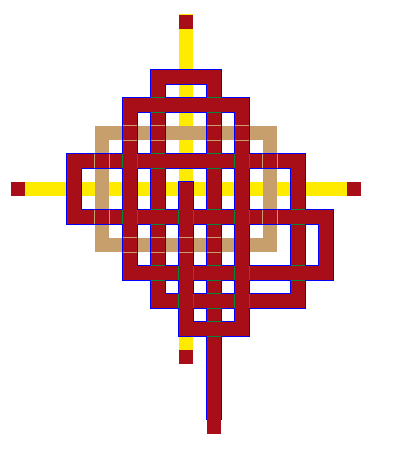

# diamond stone of pyre

end of translation

### **Hard Time**

 
 A diamond is forever, diamond hard,

 a chip of time, cutting glass,

 as pain cuts flesh, a diamond 

 is a petrified tear, sorrow

 hardened by fierce sustained

 pressure into something that 

 can stab, can endure, can break

 but only if a flaw is found.

 

 A diamond is coal that has suffered

 and burned and crystallized

 into a thing that takes light

 into itself. Do you know

 where diamonds come from?

 Whose suffering is this you wear

 glinting at your ear, winking

 from your finger? How many 

 children's eyes shine in it

 

 There is something once soft

 that grows hard, bright

 as the pressure crushes it.

 There is something once soft

 that burns harder than steel

 in the furnace of pain.

 

 Call it a diamond. Call it 

 the heart of a people.

 Call it the heart of pain

 crystallized to something that 

 can gouge armor, something

 that stands in the ashes

 of the terrible fire.

 

 Nothing is forever, not

 prison, not the pain 

 of a people pressed down,

 not the eyes of children shining

 and then dimmed, not

 diamonds glinting like

 chips of frozen sun.

 This is not a jewel 

 I would wear lightly.

 This is not a jewel 

 I would wear.

 

 

 (mailto:worlorn-webmaster@gadzikowski.com) 

### missing something you want to see?

 [top](#top) 

########## this page copyright © 1997–1998 mark gilbert gadzikowski

portions © marge piercy

all rights reserved