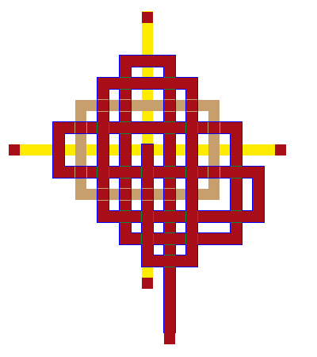

# fountains of paradise

the beautiful land of life

|  **Dominator**       |  **Aspect**        |  **Attribute**           |  **Populace**  | 
| -------------------- | ------------------ | ------------------------ | -------------- | 
|  [wielder](wielder)  |  [aspect](aspect)  |  [attribute](attribute)  |  [race](race)  | 

 

 [top](#top) 

   The Fountains of Paradise overflow with Life. All life is precious. The Fountains stand at the center of my Turf, giving the water of Life to all portions of the turf. To the North is the Forest filled with all creatures of the forest. To the West is the Desert filled with all creatures of the desert. To the South is the Grassland filled with all creatures of the grasslands. To the East is the Ocean filled with all creatures of the ocean.

   The weather of the Fountains is bright with the life giving sun during the day and lit by the moon at night.

   Travalers are welcome to enjoy the wilderness surrounding the fountain, but must remember that all life is sacred in this Turf, Death dealt on this Turf to any good or neutral creature spells doom and banishment to the dealer of the death (banishment happens as soon as the blow is delt and the Master of this Turf gains empathic ability to trace this person down to meet out justice).

   See also  [founts](founts.md) .

 

the Blood phoenix, god of life and rebirth

 [top](#top) 

   Blacksword is a man of normal features and appearence . His only claim to fame is the Blacksword he wields, no one else can see it. He loves life in all forms but does realize that just as the day needs night, Life needs death.

 

 [top](#top) 

   My archetype is Life. I grant the prayers asking for life to be given back to the Dead, I will intercede on the part of my faithful one tim ein four, and give them reincarnation. All others must pledge themselves to owe a boon to me to gain my favor, and even after the pledge then I will grant reincarnation to one being in ten.

 

 [top](#top) 

   The Star of Beauty

 
 **the high one** on The Star of Beauty:

   the **The Star of Beauty** provides, supports, and controls nine-tenths of all manifestations of *beauty* in worlorn, including but not limited to charisma, charms, enchantments, beguiling, presence attacks, and magical influence.

 

 [top](#top) 

   the phoenician elfar are a subrace of wood elf. they like to sail and are found in waterways neaer most civilized areas.

 

 [top](#top) 

 [goldroad](goldroad.md)  /  [watersea](watersea.md)  /  [llewghund](llewghund.md)  

 (mailto:worlorn-webmaster@gadzikowski.com) 

### missing something you want to see?

 [top](#top) 

########## this page copyright © 1998 mark gilbert gadzikowski

all rights reserved