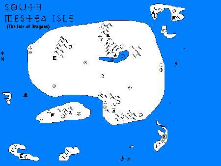
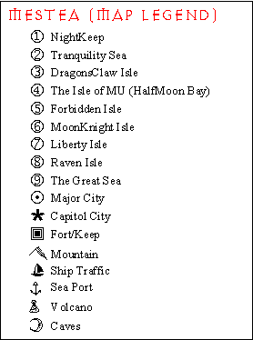

# Mestea

The Sanctuary of Shal Omnis

|  **Dominator**       |  **Aspect**        |  **Attribute**           |  **Populace**  | 
| -------------------- | ------------------ | ------------------------ | -------------- | 
|  [wielder](wielder)  |  [aspect](aspect)  |  [attribute](attribute)  |  [race](race)  | 

 

 [top](#top) 

   Founded by the Moon Knight Niteblade, the Mestean Archipelago is a collection of islands dedicated to prepare for the arrival of Shal Omnis, the sovereign deity of all Dragons. It is said that invoking the name of Shal Omnis grants instant sanctuary to any who are pursued by agents of her nemesis, Styphon.

   The Mestean Archipelago is found in the  [watersea](watersea.md)  of  [asteroid](asteroid.md) . Cooperative pacts between cousins Theseus and Llewella allow free passage between the realms.

   Peridot can not exist in Mestea, for it is mysteriously Removed from the possession of the bearer until the owner summons it within the Watersea.

 

### Mestea

The Island of the Yellow Rose

 [top](#top) 

   Mestea Island is surrounded by an immense, nearly impassable barrier reef known as **The Great Barrier**. A dome shaped membrane of pure energy surrounds the atmosphere five miles above the island. Only the leaders of the **Yellow Rose** and dragons can find their way innately. 

   Mestea is one of the  [dragonisles](dragonisles.md) , found in the  [watersea](watersea.md) .

 

 

|    |    | 
| ------------------------------ | -------------------------------------------- | 

 

 [top](#top) 

   Theseus is also known as Gerard, Gerier, and Hercules in some lands. As Archangel to his goddess, Shal-Omnis, he represents Her in Worlorn until the time for Her Arrival.

 

 [top](#top) 

   travellers will find it hard, even dangerous, to find Mestea alone. For some, however, the risk may be well worth it, for once within the Great Barrier and the Energy Dome, one is safe from all external influences. 

   In the core Sanctuary of Mestea, one may petition Theseus himself for full Sanctuary against all pursuers. Before you attempt this, make sure that your persecuters' claims against you are unjust, lest the Archangel rule against you.

   One need not suffer boredom while taking sanctuary in Mestea. Adventure and danger can be found for those who seek it. Adventurers who are worthy may find excellent sources of training in arcane weapons and magic skills lost elsewhere for centuries.

  
  

 **the high one** on the Sanctuary of Mestea:

   **The Sanctuary of Mestea** provides, supports, and controls nine-tenths of all manifestations of *sanctuary* in worlorn, including but not limited to  [abelard](abelard.md) ,  [lifehutch](lifehutch.md) , Leomund's Tiny Huts, Daern's Instant Fortresses, and Circles of Protection. No being within Mestea may be brought out or targeted by forces external to Mestea, without the explicit consent of the being or Theseus. No Worlorn turf can attack Mestea, and all Worlorn turfs will automatically defend Mestea against any extra-Worlorn attack.

 

 [top](#top) 

   Mestea is home to the MoonKnights, an Elite order of the Rose. MoonKnights are trained to bond and ride with Dragons, proficient in very specialized swordsmanship and dragonlance. The relationship is more of a partnership between dragon and mortal, and is not for everyone: Dragons choose their riders, not the other way around. Most of the humanoid races of Mestea consist of elves, halflings, and humans. Dragons on the isle often appear as humanoid figures. However, there is usually some physical distinguishing mark, if one looks closely. More than one elvish MoonKnight and his bonded Dragon have been mistaken for Kav Elfar at first glance.

   The MoonKnights are seldom seen outside Mestea. When they are, it is almost always to right wrongs, punish injustice, or hasten the day when Shal-Omnis will come to Worlorn.

 [top](#top) 

  [goldroad](goldroad.md)  /  [dragonisles](dragonisles.md)  /  [watersea](watersea.md)  /  [flambeau](flambeau.md)  /  [crosswinds](crosswinds.md)  

 (mailto:worlorn-webmaster@gadzikowski.com) 

### missing something you want to see?

 [top](#top) 

########## this page copyright © 1997–1998 mark gilbert gadzikowski

all rights reserved