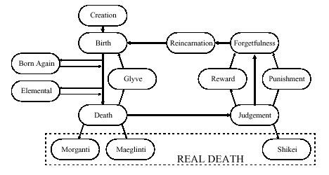

# mortal coil

 the path of a worlorn soul

**The Mortal Coil** 
   The path of a Wathan through physical incarnation is *the Mortal Coil*. 

    

    **CREATION**: All things begin on the  [kaldamaaren](kaldamaaren.md) . The  [damon](damon.md)  forges the Wathan and its original fleshy envelope to the whims of the Sentient Dragon who the Wathan is to serve. 
   **BIRTH**: The creature is born to natural parents and lives its life. The Phoenix determines how a creature is born. Life is ended by Death, being Born Again, or through confronting a pure element. 

   **DEATH**: Most lives end with death.  [deathgod](deathgod.md)  is responsible for determining all Deaths and entering them in the  [akashik](akashik.md) . A dead Wathan may not receive Inspiration of a Muse or participate in a otherwise Crossing-in-the-mist. When the Fleshy envelope dies,  [deathgod](deathgod.md)  dispatches a Minor Death Servant to escort the Wathan unerringly to the Hall of Judgement. A miracle or spell of at least Gold Rank, such as Raise Dead, must be used to summon the Wathan away from a Minor Death and place it within its previous fleshy envelope with full memory and Inspiration of a Muse. This summoning becomes part of the Akashik Record for that Wathan, and the fleshy envelope is damaged by the Gold Rank energies. 

   **BORN AGAIN**: Coven Druids may relinquish their Wathan to the Motherlode and return to life in another of the Motherlode’s servants. The Motherlode is responsible for determining which of her creatures bears the Wathan of the Coven Druid. Full memory and Inspiration of a Muse are regained with the passage of time. 

   **ELEMENTAL CONFRONTATION**: When confronted with a pure elemental force such as Ground, Wind, Water, Fire, Void, Chaos, Blood, Dust, or others, a Wathan loses itself in that Element. A conscious thought need not determine the Elemental Confrontation of a Wathan. A Master of that Element may retrieve the Wathan from the Elemental state with appropriate physical remains. 

   **GLYVE**: Human Swefen who possess four Flags of Power find themselves reincarnated in the Dung Pits of Glyve as a non-human race. Memories are preserved, but Inspiration of a Muse is not. 

   **MORGANTI**: Morgan La Faye’s Real Death Weapons, �Morganti� are responsible for consuming all of a Wathan’s Inspiration of a Muse. Morgan La Faye’s Real Death Weapons, �Morganti� are responsible for annihilating the Wathan of their victim. In the Abyss, a Wathan may be retrieved with memories but no Inspiration of a Muse. 

   **MAEGLINTI**: Maeglin high-Jerusalem Sathonys’ Real Death Weapons �Maeglinti� are responsible for consuming all of a Wathan’s Dreams. Maeglin high-Jerusalem Sathonys’ Real Death Weapons �Maeglinti� are responsible for annihilating the Wathan of their victim. In the Abyss, a Wathan may be retrieved with memories but no Dreams. 

   **JUDGEMENT**: The Blood Phoenix holds court of the Powers of Worlorn System to determine whether a Wathan has offended those responsible for its disposition with willful acts. The Blood Phoenix may speak seventeen Words of Tribulation against a Wathan. One word of Tribulation may be spoken by each attending god or goddess recognized by a Worlorn System Telesterion. One tenth of a word of Tribulation may be spoken by each attending GOLDEN ATTRIBUTE. A quorum of Seventeen words must be raised for a Virtuous Judgement to be Made. If all who attend elect to keep silent then the Wathan is given Reward before encountering Forgetfulness. If all who attend speak a word of tribulation or portion thereof, then the Wathan is given Punishment before encountering Forgetfulness. A mixed response of words and silence kept gives a Wathan immediate Forgetfulness. 

   **SHIKEI**: The Blood Phoenix may give the Judgement Malign and deliver the Real Death. Historically this Judgement has been reserved for Stone Brothers and huldrafolk with hubris. 

   **PUNISHMENT**: A Wathan found wanting by the Hall of Judgement passes through the First Door Guarded into Hell for Longer Than the Soul Can Bear. The Dominator of Hell determines the manifestation of Punishment. 

   **REWARD**: A Wathan found pleasing to the Hall of Judgement passes through the Second Door Guarded to Heaven for Seventeen Moments. The Dominator of Heaven determines the manifestation of Reward. 

   **FORGETFULLNESS**: The Wathan is given time to forget previous lives and Inspiration of a Muse in The Dominion of Death. Deathgod is responsible for this duty. A Platinum Rank miracle or spell may retrieve the Wathan from the Dominion of Death, often before the Wathan forgets the memories of a previous life or Inspiration of a Muse. 

   **REINCARNATION**: An empty Wathan receives a new fleshy envelope in the Gene Pools. The Blood Phoenix is responsible for this duty. The Platinum Rank wizard spell of this name brings a Wathan to this state in an hour! 

 (mailto:worlorn-webmaster@gadzikowski.com) 

 
### missing something you want to see?

 [top](#top) 

 
########## this page copyright © 1999 mark gilbert gadzikowski

 all rights reserved